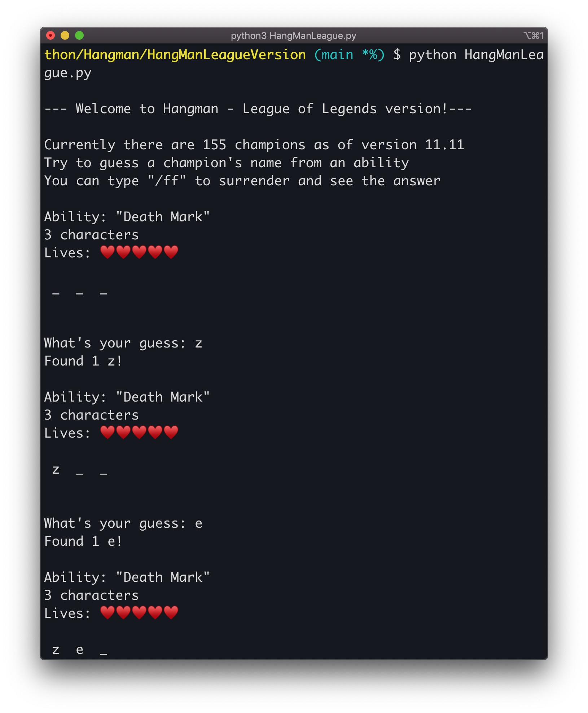
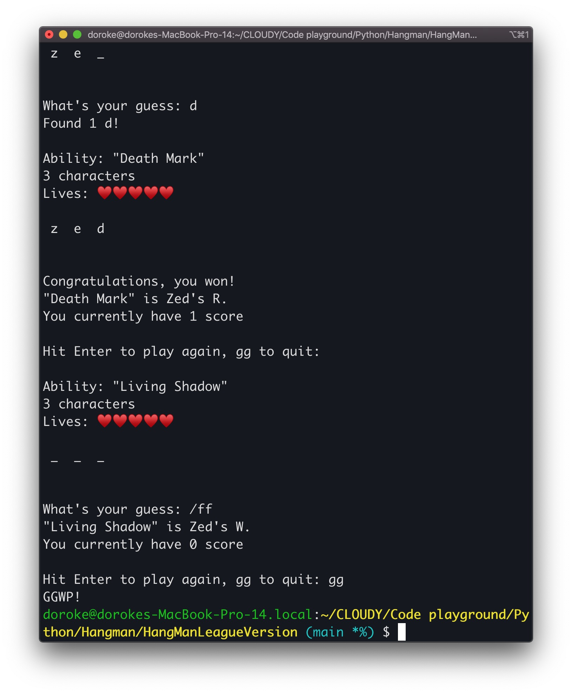

<h1 align="center">Hangman - League of Legends version</h1>

<h2>What is this?</h2>

I'm a big fan of League of Legends (and Zed, with over 2 mastery points on all accounts - not flexing btw 🌚 ). 
 

This is a Hangman console game of guessing a champion name from an ability

<h2>How to play?</h2>

You don't need to install any extra library to play the game. Simply execute the following command:
 

<code>python3 HangManLeague.py</code>

<h2>How to update new champions?</h2>

Replace the URLs in the <code>get_all_champ_abilities.py</code> file with the latest League version. Run the file to produce a new <code>league.json</code> file.
 